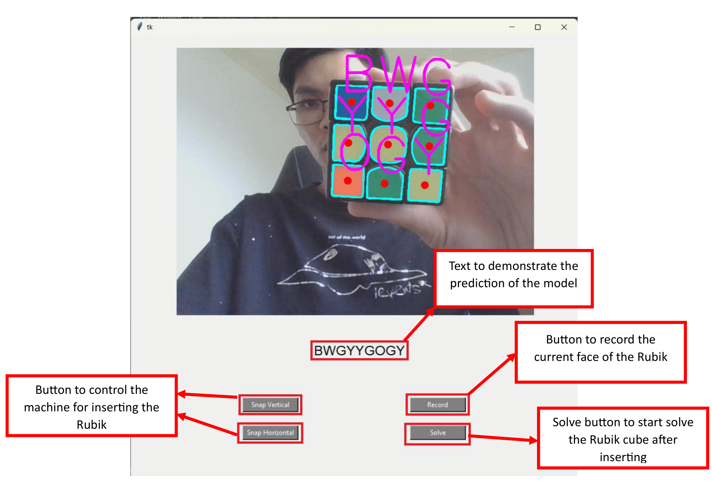

# Rubik-Solver
## Color Detection Steps
1. converting an image to gray scale
2. an image from the camera will be blurred in order to avoid sharp edges
3. using canny function from opencv for finding all the edges from an image
4. dilating an image
5. applying the contours function to find the contours which satisfies the condition on area to avoid unnecessary contours
6. constructing all pixels inside each contour and computing average RGB values
7. using machine learning model to predict each faces and stored as an array

## Explanation For Application
NOTE:
1. For each prediction of the face, it should be double-checked by the text in the middle of the app
2. Insert the Rubik cube in the orientation where White face at top and Red face in the front
3. Insert the face in order which is White, Blue, Red, Yellow, Green, and Orange

## Design of Machine
My design has 6 servo motors where 4 of them used for rotating the Rubik and 2 for opening, closing and changing the orientation of the Rubik.
Due to using servo motors for rotating, it needs to be returned to the original position after it turns the Rubik. All the model of each part 
of the design included the assembly of the machine is listed in "Parts" folder.

